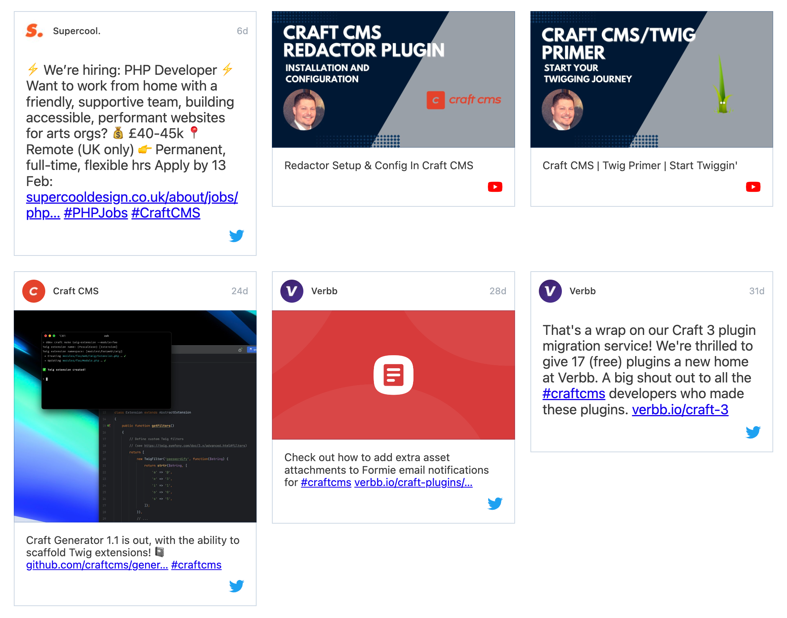
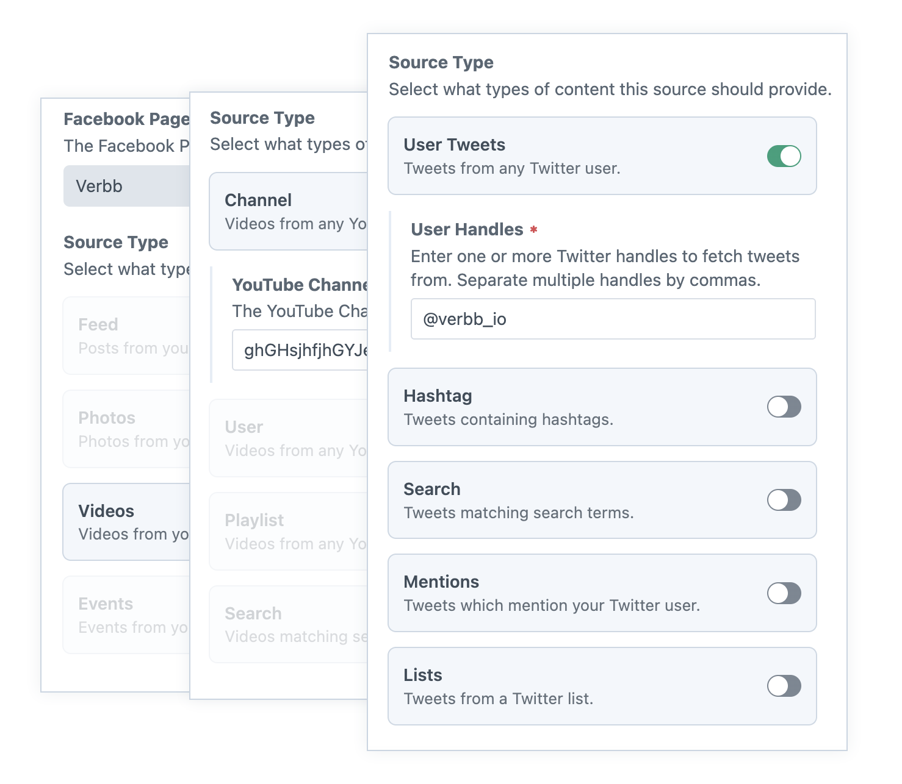
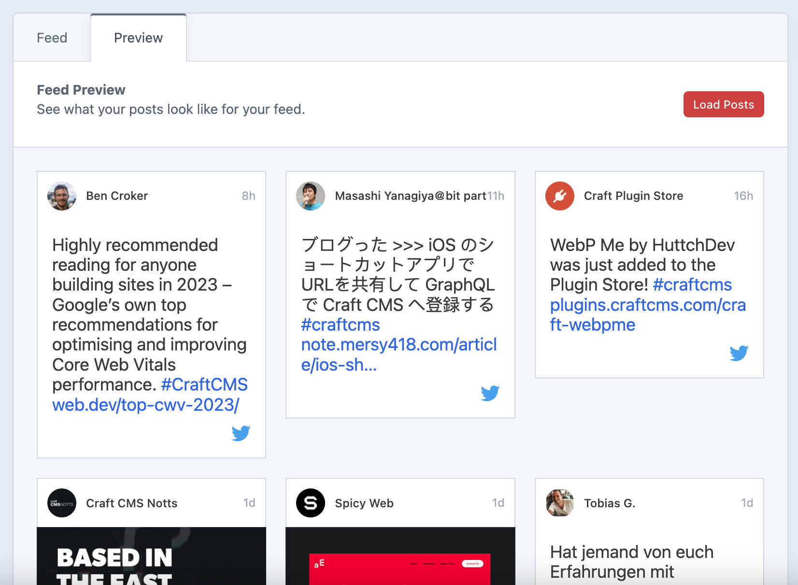

<!-- feature-intro -->
Fetch selected content from supported social accounts and combine several sources into one feed. Cache updates in the background, preview the result in Craft and present it on the site with Twig or GraphQL.
<!-- feature-intro-end -->

<!-- feature-section media-size="large" media-shadow="false" -->
## Create a social feed

Aggregate social content by combining multiple sources into a single feed. Choose the content each source contributes, then control exactly how every post looks or start with the included presentation.

<!-- feature-section-end -->

<!-- feature-section media-size="large" media-shadow="false" -->
## Control what content to show

Use each provider’s available filters to focus a source on the content the site actually needs. Start with the ready-to-go template or query feed items in Twig for complete control, while background caching avoids asking providers for the same posts on every page view. Project-specific source types can join the same feed through plugin events.

<!-- feature-section-end -->

<!-- feature-section media-size="large" -->
## Preview feed content

Preview the combined feed from the control panel before building it into the site. Check that connected sources, filters and ordering produce the content the team expects without repeatedly switching to a front-end template.

<!-- feature-section-end -->
